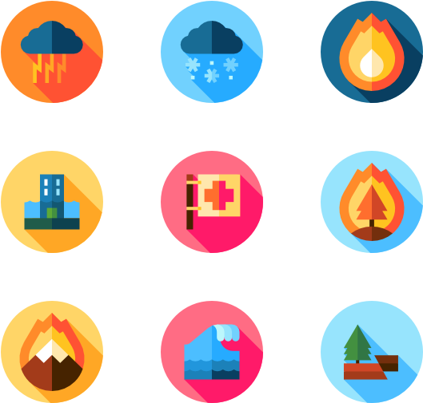

# Disaster Response Pipeline Project
<!-- PROJECT SHIELDS -->

[![Contributors][contributors-shield]][contributors-url]
[![Forks][forks-shield]][forks-url]
[![Stargazers][stars-shield]][stars-url]
[![Issues][issues-shield]][issues-url]
[![MIT License][license-shield]][license-url]
[![LinkedIn][linkedin-shield]][linkedin-url]


<!-- PROJECT LOGO -->
<br />
<p align="center">
  <a href="https://github.com/guerre381/udacity_project_2">
    
  </a>

  <h3 align="center">Disaster Response Pipeline</h3>

  <p align="center">
    UDACITY online training in Data Science  
    <br />
    <a href="https://github.com/guerre381/udacity_project_2">View Demo</a>
    ·
    <a href="https://github.com/guerre381/udacity_project_2/issues">Report Bug</a>
    ·
    <a href="https://github.com/guerre381/udacity_project_2/issues">Request Feature</a>
  </p>
</p>


<!-- TABLE OF CONTENTS -->
<details open="open">
  <summary><h2 style="display: inline-block">Table of Contents</h2></summary>
  <ol>
    <li><a href="#about-the-project">About The Project</a></li>
    <li><a href="#built-with">Built With</a></li>
    <li><a href="#ml-pipeline">Ml-Pipeline</a></li>
    <li><a href="#content">Content</a></li>
    <li><a href="#getting-started">Getting Started</a></li>
    <li><a href="#installation">Installation</a></li>
    <li><a href="#contributing">Contributing</a></li>
     <li><a href="#acknowledgements">Acknowledgements</a></li>
    <li><a href="#contact">Contact</a></li>
  </ol>
</details>

<!-- ABOUT THE PROJECT -->
## About The Project
Web application filtering out messages sent after a natural disaster occurred. 
Such application can help appropriate disaster relief agencies to categorize and therefore prioritize
 all events. 
 
 Machine learning is the key. The web application relies on an NLP model in the background.
It classifies input messages into several categories labeled with relevant keywords. 

This project starts with data wrangling. It continues with building, training and testing of the model until 
deployment online. 

<!-- GETTING STARTED -->
## ML-Pipeline

NLP model classfier:
* Inputs:   raw text messages (string)
* outputs:  36 overlapping categories (binary 1/0)

The pipeline is a 3 steps sequence:
1. Transform: tokenization and lemmatisation 
2. Transform: weighted mean word embedding with corresponding tfidf coefficient
3. Classify: Dense neural network with 36 neuron output

[Test results](models/test)

The model can be improved with a different classifier like ensemble techniques.
Neural network was prefered because of fast learning. However, there are too many false negative.
Recall is low.

<!-- Built with -->
## Built With
The code is written in Python 3.8 in a jupyter notebook. 
It relies mainly on the following libraries:

* [Flask 1.1.2](https://flask.palletsprojects.com/en/1.1.x/)
* [gensim 3.8.3](https://radimrehurek.com/gensim/)
* [nltk 3.5](https://www.nltk.org/)
* [scikit-learn 0.24.1](https://scikit-learn.org/stable/)
* [plotly 4.14.3](https://plotly.com/)
* [SQLAlchemy 1.3.23](https://www.sqlalchemy.org/)
* [pandas 1.2.3](https://pandas.pydata.org/)


<!-- Content -->
## Content
The project file structure is decomposed in 3 folder for 3 distinct activities handled by
the python scripts they respectively encapsulate.

    ├── data 
    │   ├── process_data.py                 # ETL pipeline - data wrangling script
    │   ├── disaster_categories.csv         # raw data
    │   ├── disaster_messages.csv           # raw data
    │   └── database.db                     # clean data
    │ 
    ├── models 
    │   ├── train_classifier.py             # ML pipeline - build, train, test, and save model
    │   ├── custom_transformers.py          # customized transformers for pipeline
    │   ├── model.pkl                       # saved model
    │   └── test 
    │       ├── classification_report.md    # test output - precision, recall, and F1-score for each category
    │       └── confusion_matrix.md         # test output - confusion matrix for each category
    │ 
    ├── app 
    │   ├──run.py                           # web application manager
    │   └── templates                       
    │       ├── go.html
    │       └── master.html
    │
    ├── requirements.txt                    # python environment rquirements  
    ├── logo.png                            # read me logo
    └── README.md                           # current file
    
* The data folder contains the ETL pipeline. 
* The models contains the ML pipeline. 
* The app folder encapsulates web app management and rendering. 

<!-- GETTING STARTED -->
## Getting Started

To get a local copy up and running follow these simple steps:
1. create a virtual environment for Python 3.8 or higher.
2. clone udacity_project_2 repository
3. install all required libraries from requirements.txt
4. follow instructions

### Instructions:
1. Run the following commands in the project's root directory to set up your database and model.

    - To run ETL pipeline that cleans data and stores in database
        ```sh 
        python data/process_data.py data/disaster_messages.csv data/disaster_categories.csv data/DisasterResponse.db
        ``` 
    - To run ML pipeline that trains classifier and saves
        ```sh 
        python models/train_classifier.py data/DisasterResponse.db models/classifier.pkl
        ```
2. Run the following command in the app's directory to run your web app.
    ```sh 
    python run.py
   ```

3. Go to http://0.0.0.0:3001/ from web browser


<!-- INSTALLATION -->
## Installation

Clone the udacity_project_2 repository
   ```sh
   git clone https://github.com/guerre381/udacity_project_2.git
   ```

<!-- CONTRIBUTING -->
## Contributing

If you want to continue the analysis and get more from the data, your contribution would be appreciated.

1. Fork the Project
2. Create your Feature Branch (`git checkout -b feature/AmazingFeature`)
3. Commit your Changes (`git commit -m 'Add some AmazingFeature'`)
4. Push to the Branch (`git push origin feature/AmazingFeature`)
5. Open a Pull Request

<!-- ACKNOWLEDGEMENTS -->
## Acknowledgements
* [Udacity](https://www.udacity.com/)
* [Figure Eight](https://appen.com/press-release/appen-to-acquire-figure-eight/)
* [Nadbordrozd blog](http://nadbordrozd.github.io/blog/2016/05/20/text-classification-with-word2vec/)

<!-- CONTACT -->
## Contact

Romain Guerre - guerre_romain38@hotmail.com

Project Link: [https://github.com/guerre381/udacity_project_2](https://github.com/guerre381/udacity_project_2)


[contributors-shield]: https://img.shields.io/github/contributors/guerre381/udacity_project_2.svg?style=for-the-badge
[contributors-url]: https://github.com/guerre381/udacity_project_2/graphs/contributors
[forks-shield]: https://img.shields.io/github/forks/guerre381/udacity_project_2.svg?style=for-the-badge
[forks-url]: https://github.com/guerre381/udacity_project_2/network/members
[stars-shield]: https://img.shields.io/github/stars/guerre381/udacity_project_2.svg?style=for-the-badge
[stars-url]: https://github.com/guerre381/udacity_project_2/stargazers
[issues-shield]: https://img.shields.io/github/issues/guerre381/udacity_project_2.svg?style=for-the-badge
[issues-url]: https://github.com/guerre381/udacity_project_2/issues
[license-shield]: https://img.shields.io/github/license/guerre381/udacity_project_2.svg?style=for-the-badge
[license-url]: https://github.com/guerre381/udacity_project_2/blob/master/LICENSE.txt
[linkedin-shield]: https://img.shields.io/badge/-LinkedIn-black.svg?style=for-the-badge&logo=linkedin&colorB=555
[linkedin-url]: https://www.linkedin.com/in/romain-guerre-14b4a891/


